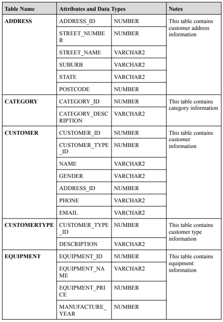
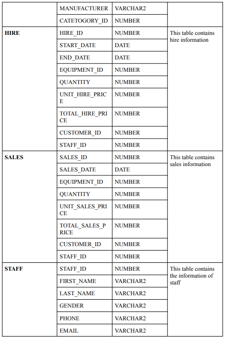
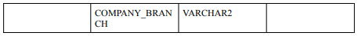

# Problem Description - MonEquip Data Warehousing

Monash Equipment Centre (MonEquip) is an Australian-based company that provides a wide range of equipment for civil infrastructure and commercial construction projects. The company has two main business functions: 

● selling equipment along with excellent after-sales service

● providing equipment for hire while ensuring a seamless hiring experience.

MonEquip has different branches throughout the state of Victoria, in which the management team frequently generates reports to keep track of the business (e.g. calculating the revenues from hiring and selling equipment). The reports are then used for forecasting various trends and making predictions about the business.

MonEquip currently has an existing operational database which maintains and stores all of the information of their business transactions (e.g. product hiring, product sales, equipment, etc.) required for the management's daily operation. The operational database records the transaction from April 2018 to December 2020. However, since the staff at MonEquip has limited database knowledge and the operational database is quite large, the management team has decided to hire you as a Data Warehouse Engineer to design, develop, and quickly generate Business Intelligence reports from a new Data Warehouse.

The data definition of each table in MonEquip is as follows:

For the daily operation, MonEquip normally purchases equipment from its suppliers. The company then resells the equipment to customers while also providing a hiring service. When an equipment is purchased, the price of the equipment is kept in the Equipment table as EquipmentPrice. Meanwhile, the hiring rate is calculated as follows: 

● The unit hire price is the hiring rate per day. 

● If the customer returns the equipment within the same day, they only need to pay for 50% of the unit hire price. 

● Otherwise, Total hire price is calculated as (End Date - Start Date) * UnitHirePrice * Quantity.

As you are required to design a Data Warehouse for MonEquip, the Operational Database tables can be accessed through the MonEquip account. You can, for example, execute the following query: 

`select * from MonEquip.<table_name>`
